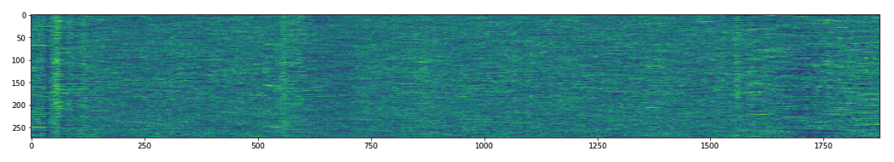
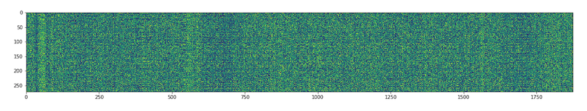

# Motor imagery and GAN

This repository save my work about GAN applied to motor imagery eeg signals, my first attempt to work with Motor Imagery and GAN was create Numpy-friendly library of the BCI Competition 2008 dataset. For this work I used the Dataset IV 2a from the mentioned competititon. The fixed to python dataset is in other repository, you can use it from: [https://github.com/bregydoc/bcidatasetIV2a](https://github.com/bregydoc/bcidatasetIV2a).

Principaly I want to test, deduce and see how the common dataset of Motor Imagery is driven by a Generative Adversarial Networks (GAN), in the figure below you can see one image where I ploted all trial of one subject of the channel C3 (In this case for the subject 1 I have 273 valid trials), in the image each pixel of height is a trial and its corresponding row is all the EEG signal.

    

Then I've created a GAN net [Tensorflow](https://www.tensorflow.org) and [Keras](https://keras.io). Below you can see the generated trials after to train process, it's noisy but the train process is not completed.

    

The most interesting in the above image is how to the GAN net extracted the most important signal (e.g. bell at the start of signal).

You can read the code in [this notebook](gan_for_motorimagery.ipynb)
